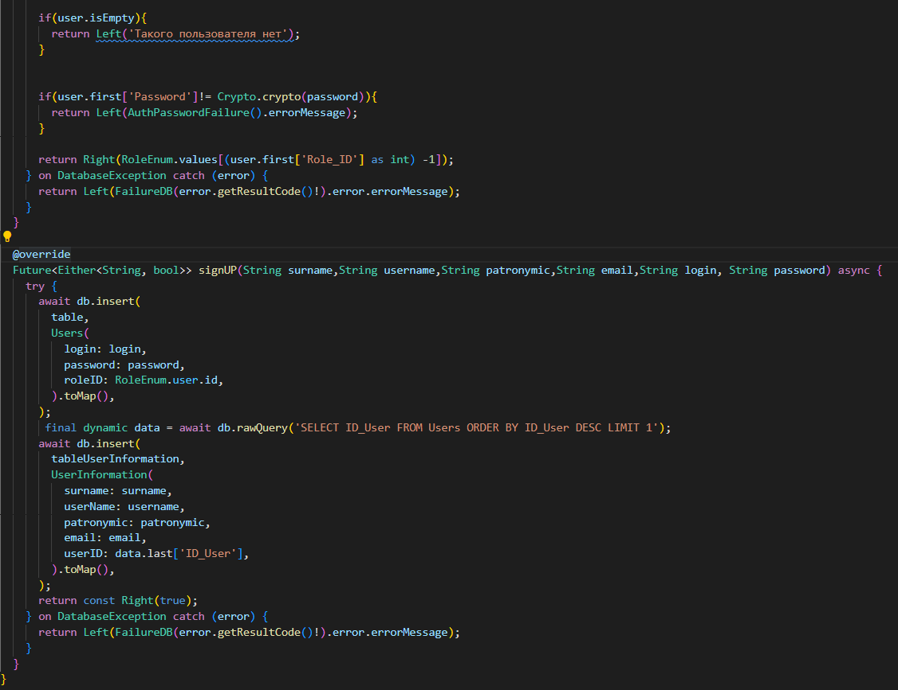
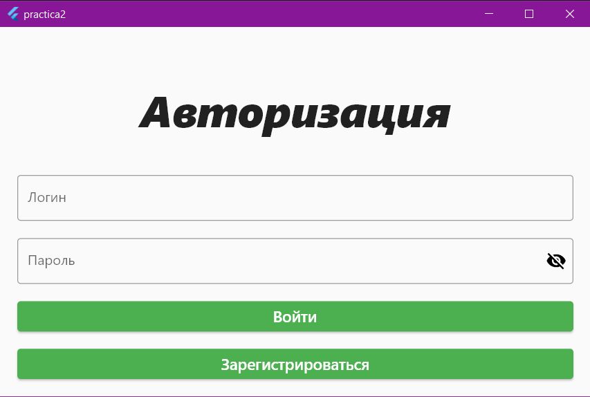
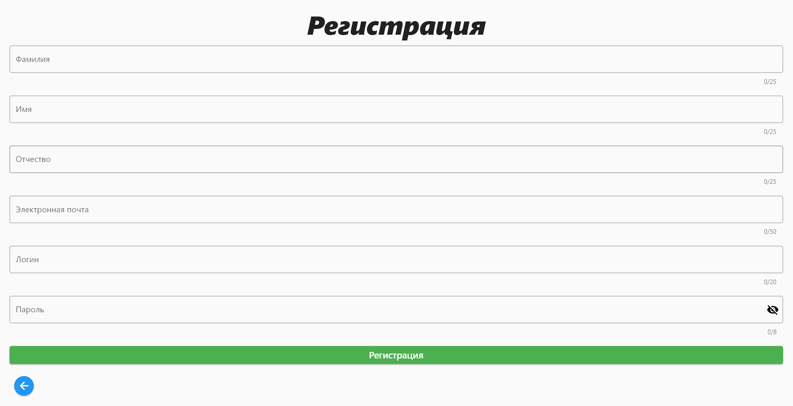
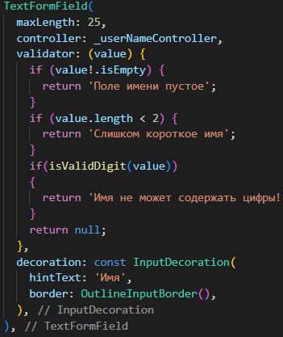
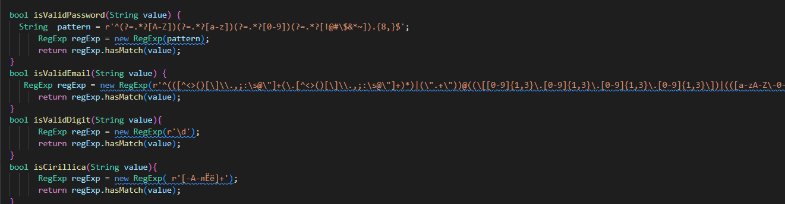
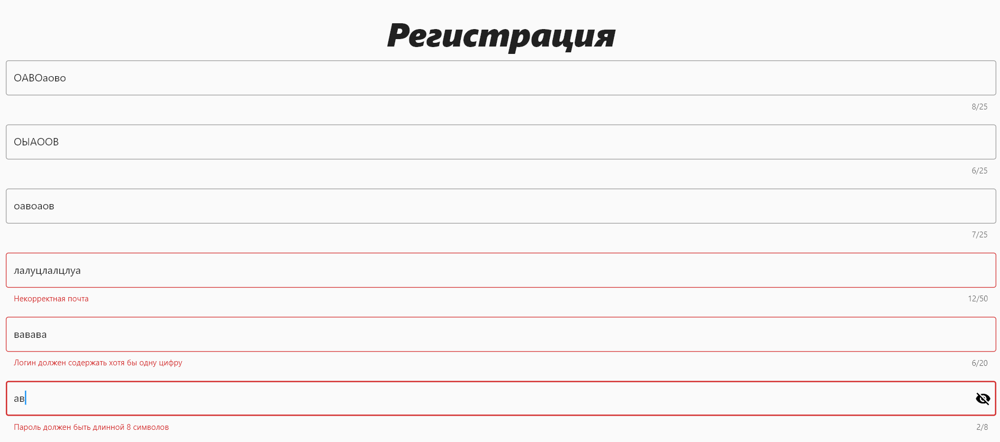

# ПРАКТИЧЕСКАЯ РАБОТА №3
 ##  Продолжение работы с базой данных SQLite, создание авторизации и регистрации.

<b>Цель работы:</b> необходимо реализовать регистрацию и авторизацию пользователя. Каждое поле на экране авторизации и регистрации провалидировать минимум 3 критериями максимум 5. После успешной авторизации перейти на экран в зависимости от роли пользователя. Если авторизация или регистрация не удалась нужно вывести сообщение при помощи Snack Bar.

<b>Ход работы:</b>

Для реализации авторизации и регистрации на учебных занятиях были созданы и реализованы классы, такие как: auth_user_case, auth_repositories_impl, auth, auth_repositories. Также был реализован класс app_router, который необходим для навигации в приложении, класс crypto, который позволяет шифровать пароли, хранящиеся в базе данных, класс failure, в котором хранятся выводимые пользователю ошибки.
Основной класс в котором происходит обработка авторизации и регистрации – это  auth_repositories_impl

 

 Рисунок 14 - auth_repositories_impl

Для начала необходимо отверстать страницы и настроить переходы между окнами в классе app_router.

  

Рисунок 15 - Окно авторизации

 

Рисунок 16 - Окно регистрации

Окна администратора и пользователя пока пусты, на них есть только надписи, для определения, что это за окно.

 

Рисунок 17 - Окно администратора

 

Рисунок 18 – Пример проверяемого поля

Рисунок 19 – Регулярные выражения для проверок

Проверка полей происходит с помощью регулярных выражений, которые написаны в окне регистрации. И возвращают true если проверка прошла или false если нет. Если поле не соответствует проверка, тогда оно подсвечивается красным и указывает на ошибку при введении данных.

 

Рисунок 20 – Регулярные выражения для проверок

 <b>Вывод:</b>в ходе практической работы удалось реализовать регистрацию и авторизацию пользователя. Каждое поле на экране авторизации и регистрации соответствует минимум 3 критериями проверок максимум 5. После успешной авторизации перейти на экран в зависимости от роли пользователя. Если авторизация или регистрация не удалась нужно вывести сообщение при помощи Snack Bar. 

