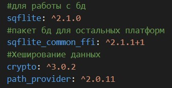
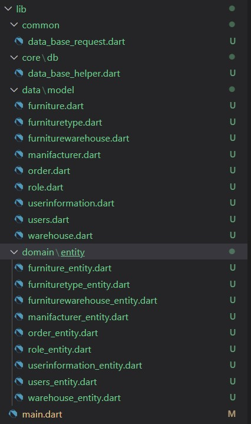
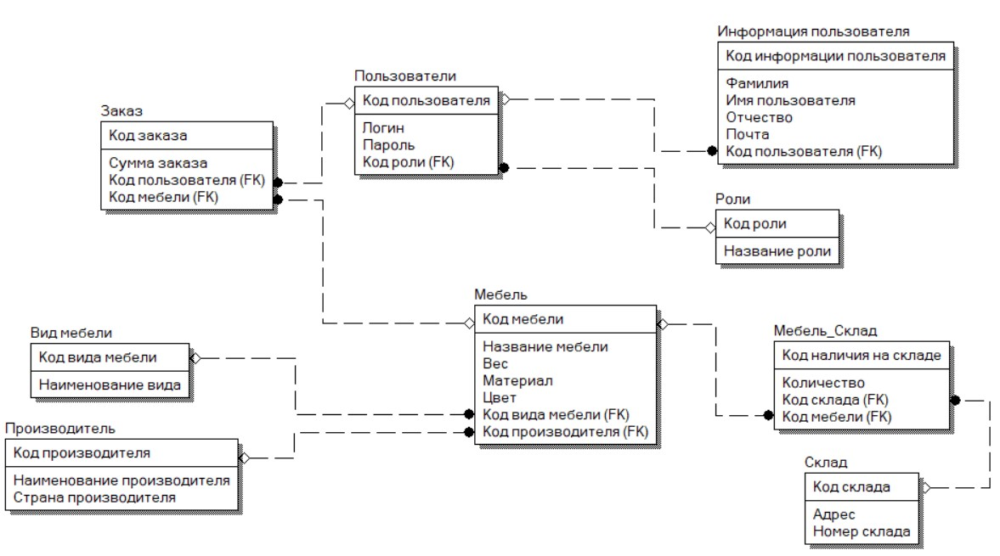
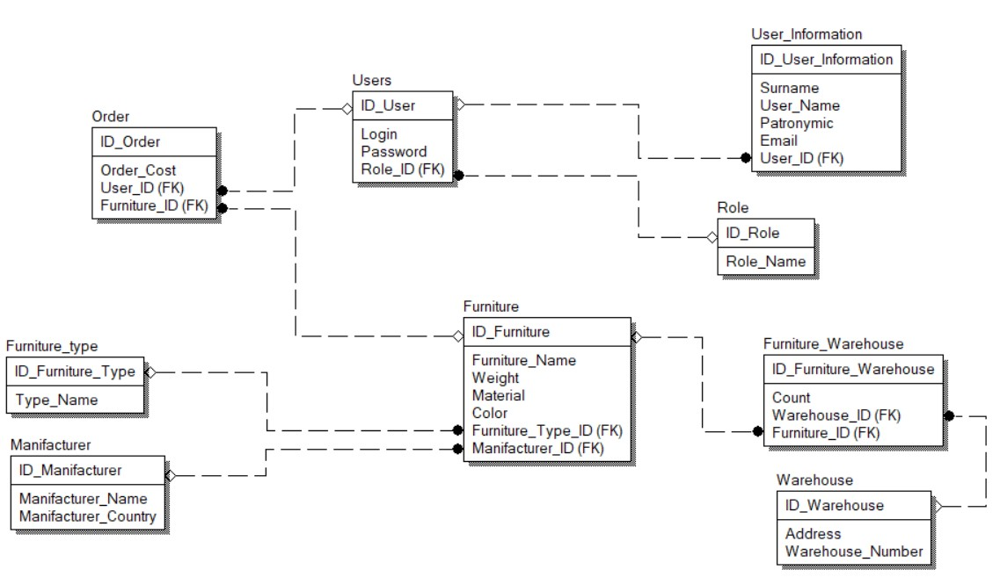
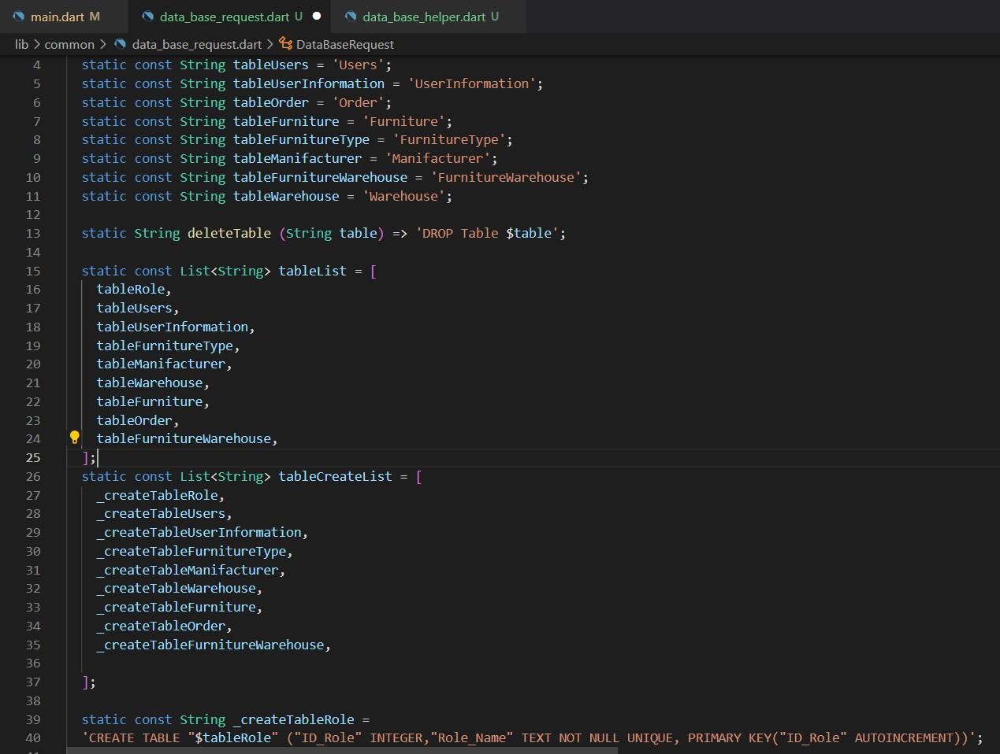
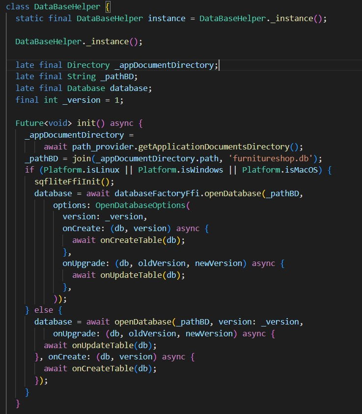
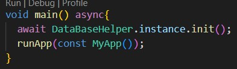

# ПРАКТИЧЕСКАЯ РАБОТА №2
 ##  Работа с базой данных SQLite.

<b>Цель работы:</b> необходимо реализовать класс, который отвечает за базу данных. Реализовать следующие функции:
- init - инициализация базы данных для всех платформ
- onCreateTable - создание таблиц 
- onUpdateTable - обновление таблиц
- onInitTable - заполнение таблиц данными
- onDropDataBase - удаление базы данных 
Реализовать таблицы для предметной области "Магазин мебели".

<b>Ход работы:</b>

Для начала необходимо подключить библиотеки для работы с базой данных.

 

 Рисунок 6 - Библиотеки для работы с БД

Затем делаем чистую архитектуру, создавая необходимые папки и файлы.

  

Рисунок 7 - Чистая архитектура

Затем проектируем нашу базу данных.
 
 

Рисунок 8 - Логическая модель

 

Рисунок 9 - Физическая модель

После чего необходимо в файле data_base_request прописать запросы на создание таблиц и удаление, для более простого взаимодействия в коде.
 
Рисунок 10 - Data_base_request

 

После чего в классе DataBaseHelper прописываем функции для взаимодействия с базой данных в зависимости от платформы.

 
 
Рисунок 11 -DataBaseHelper

Далее в файле main необходимо прописать инициализацию базы данных.

 
 
Рисунок 12 - Main

После чего запускаем проект и проверяем создался ли файл с базой данных.
 

Рисунок 13 - Созданный файл

 <b>Вывод:</b> удалось реализовать класс, отвечающий за базу данных, прописать запросы для создания базы данных, создать логическую и физическую модель базы данных, а также проверить создание файла с базой данных. 

