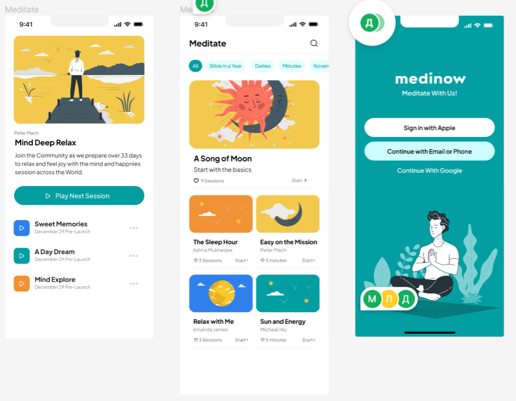
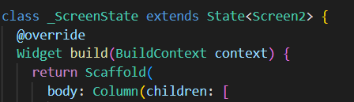
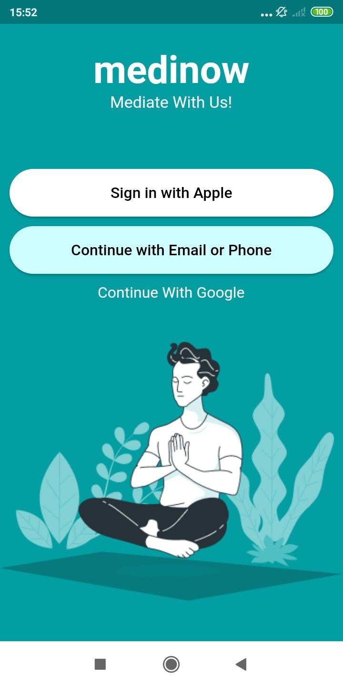
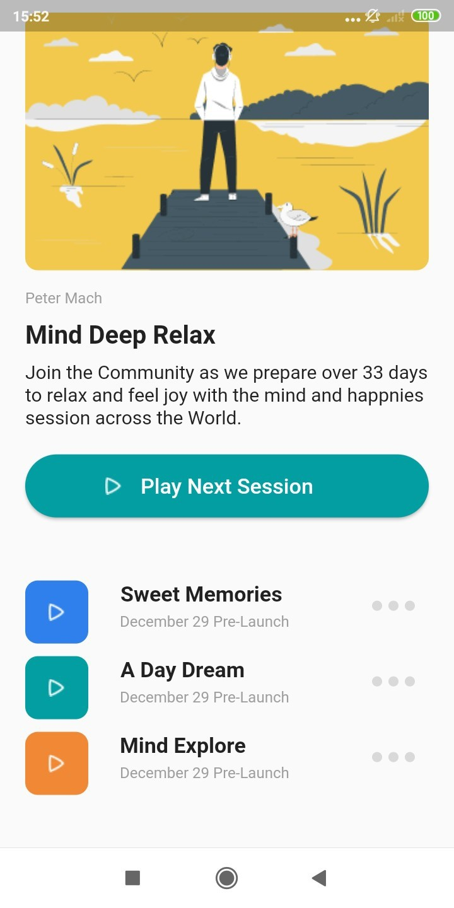
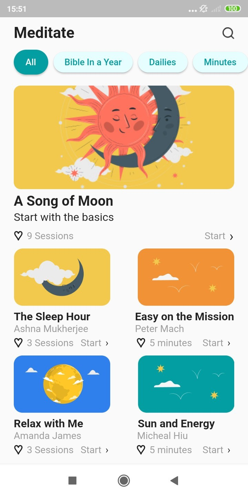

# Практическая работа №1
## Работа с основными виджетами

Цель работы: необходимо выбрать от 1 до 3 предложенных макетов приложения и, используя основные виджеты и знания, полученные в ходе изучения flutter сверстать макеты.
Ход работы:
Для выполнения работы были выбраны следующие макеты приложения:

 
Рисунок 1 – Макеты приложения

Для начала необходимо прописать Scaffold для отображения последующей написанной верстки, после чего все последующие виджеты в каждом из макетов помещались в Column.
 

Рисунок 2 – Начало макета
 
 
Рисунок 3 - Первый макет

Вначале поместили Column в Center для того, чтобы отцентрировать всё, что будет находиться на верстке, затем добавили текст и настроили его с помощью TextStyle, затем добавили два ElevatedButton, сделали скругленные края с помощью StadiumBorder, и настроили им цвет с помощью primary. Затем снова сделали текст, после чего добавили картинку в assets, затем прописали Expand и вставили туда картинку, чтобы она заняла всё остальное место, после чего просто задали цвет заднему фону с помощью backgroundcolor.
 

Рисунок 4 - Второй макет

Во втором макете не удалось скопировать картинку вместе с фоном поэтому был создан закругленный контейнер с необходимым цветом заднего фона, после чего в него была вставлена необходимая картинка. Затем производилась настройка примерно, как в первом макете. Настроили текст сделали отступы с помощью margin, закруглили кнопки, а стрелочки поместили на кнопки с помощью виджета Stack, затем нижние элементы макета разместили в виджеты Row и Column в зависимости от необходимсти. 
 
 
Рисунок 5 - Третий макет

Были использованы виджеты, как и в прошлых макетах, вначале в Row поместили надпись и картинку лупы. После чего в следующий Row поместили кнопки. Затем добавили картинку, настроили отступы через margin, отредактировали текст, затем помещали попарно объекты в Row и настраивали отступы для симметрии.
Вывод: удалось создать 3 макета из предложенных, используя основные виджеты и знания, полученные в ходе изучения flutter.
